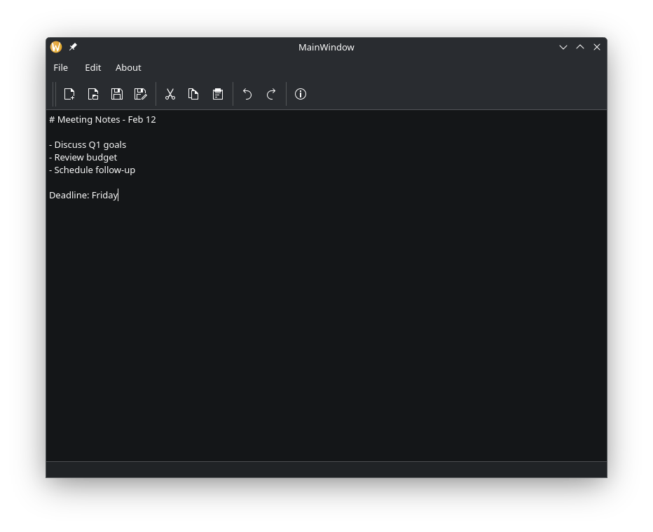

<div align="center">
  
  # 📝 NotePied
  
  
  
  *A clean, lightweight note-taking application for Linux*
  
  [](https://github.com/PiezoGo/NotePied)
  [](https://www.qt.io)
  [](https://github.com/PiezoGo/NotePied/releases)
  [](https://opensource.org/licenses/MIT)
  [](https://github.com/PiezoGo/NotePied/stargazers)
  
  **No dependencies • No installation • Just download and run**
  
  [⬇️ Download AppImage](https://github.com/PiezoGo/NotePied/releases) • 
  [🐛 Report Bug](https://github.com/PiezoGo/NotePied/issues) • 
  [💡 Request Feature](https://github.com/PiezoGo/NotePied/discussions)
  
</div>

---

## ✨ Features

<div align="center">
  
| | Feature | Description |
|---|---------|-------------|
| 📄 | **Create Notes** | Start fresh with a blank document |
| 📂 | **Open Files** | Load existing `.txt` files |
| 💾 | **Save & Save As** | Save your work locally |
| ✂️ | **Edit Tools** | Cut, Copy, Paste, Undo, Redo |
| ℹ️ | **About Dialog** | Version info and credits |
| 🖥️ | **Portable** | No installation required |
| 🐧 | **Linux Native** | Built with Qt5 for performance |

</div>

---

## 📸 Screenshot

<div align="center">
  
  ### Main Editor
  
  <br>
  <sub>Clean, distraction-free interface with sample meeting notes</sub>
  
</div>

---

## 🚀 Quick Start

### **Option 1: Download & Run (No Installation!)**

```bash
# 1. Download the AppImage
wget https://github.com/PiezoGo/NotePied/releases/download/v1.0.0/NotePied-x86_64.AppImage

# 2. Make it executable
chmod +x NotePied-x86_64.AppImage

# 3. Run it!
./NotePied-x86_64.AppImage